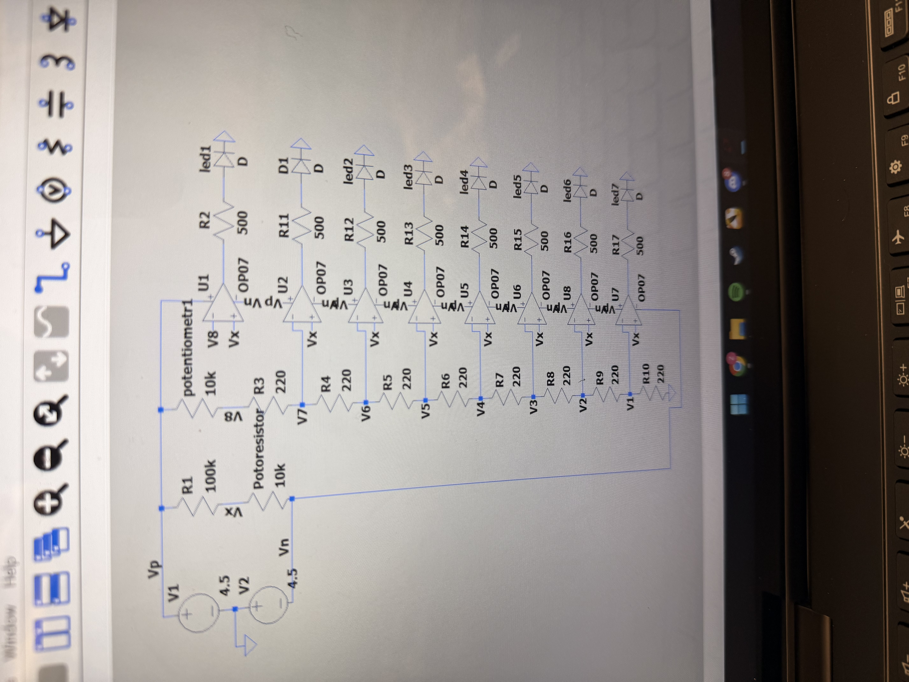

# ECE 2001 - Temperature & Light Sensor Project

This project uses thermistors, photoresistors, comparators, and LEDs to detect changes in temperature and the position of a light source.

## Temperature Sensor

The temperature sensor uses a thermistor and 8 comparators with different voltage thresholds. As the thermistor warms up, more LEDs turn on to indicate the temperature level.

I designed and simulated the circuit in LTspice before building and testing it on a breadboard.

## Light Sensor

The light sensor uses photoresistors to detect the position of a phone flashlight. As the light moves across the sensors, one of 8 LEDs turns on to indicate its position.

## Demo

[Watch the circuit demo](ECE2001.mp4)

## Components & Tools

- LTspice
- OP07 op-amps
- Thermistor & photoresistors
- Potentiometers & resistors
- LEDs
- Breadboard
